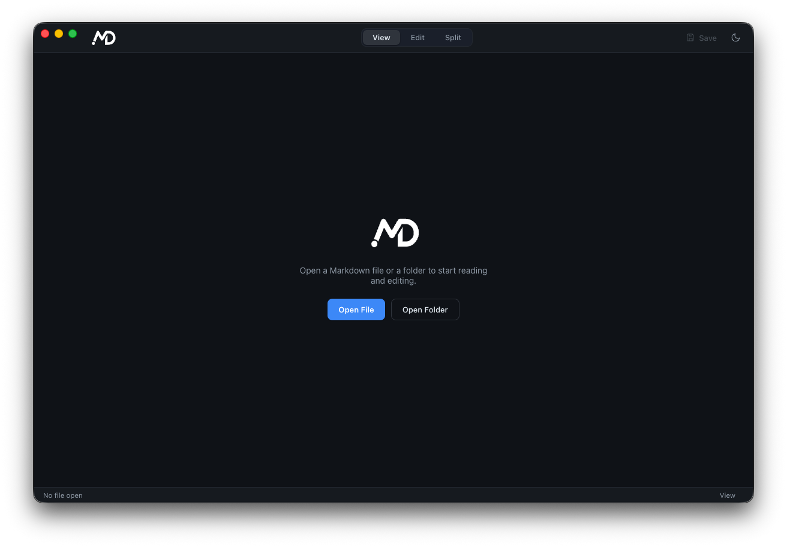

# DotMD

A minimal, cross-platform desktop app for reading and editing Markdown — built with Electron.



---

## Why DotMD?

Markdown deserves a calm place to read and write. DotMD keeps the interface out of your way: open a file or folder, pick **View**, **Edit**, or **Split**, and focus on the content.

## Features

- **Open a file or a folder** — browse `.md` files in a sidebar when you open a directory
- **Three modes** — **View** (preview), **Edit** (plain text), **Split** (side by side)
- **Live preview** — rendered Markdown updates as you type (in Edit and Split)
- **Light & dark themes** — follows your system appearance, with a manual toggle that is remembered
- **Status bar** — current file, mode, word count, and character count
- **Keyboard shortcuts** — standard shortcuts for open, save, and close
- **Minimal UI** — no clutter; tools appear when you need them

## Keyboard shortcuts

| Action | macOS | Windows / Linux |
|--------|-------|-----------------|
| Open file | `⌘ O` | `Ctrl O` |
| New / open file | `⌘ T` | `Ctrl T` |
| Open folder | `⌘ ⇧ O` | `Ctrl Shift O` |
| Save | `⌘ S` | `Ctrl S` |
| Close file | `⌘ W` | `Ctrl W` |

## Getting started

### Run from source

```bash
git clone <your-repo-url>
cd MarkdownReader
npm install
npm start
```

> The `start` script unsets `ELECTRON_RUN_AS_NODE` (fixes a common shell issue on macOS). On Windows you can also run `npx electron .`.

## Build installers

Requires [Node.js](https://nodejs.org/) and npm.

```bash
npm install -D electron-builder   # or: make install
npm run dist                      # installers → dist/
```

### Makefile targets

```bash
make install      # npm install + electron-builder
make mac          # macOS Intel + Apple Silicon (.dmg / .zip)
make mac-arm      # macOS Apple Silicon only
make mac-intel    # macOS Intel only
make win          # Windows NSIS installer
make linux        # Linux AppImage
make clean        # remove dist/
```

Cross-compiling has limits: building Windows installers from macOS needs Wine; building Linux from macOS often needs Docker. Building on each target OS is the most reliable approach.

## Open `.md` files with DotMD

**Yes** — but you need the **installed app** (`npm run dist` or `make mac`), not `npm start`. The installer registers DotMD for `.md`, `.markdown`, `.mdown`, and `.mkd`.

After installing:

### macOS
1. Right-click any `.md` file → **Get Info**
2. **Open with** → choose **DotMD** → **Change All…**

Or double-click a `.md` file once DotMD is the default.

### Windows
1. Install from the NSIS installer in `dist/`
2. **Settings** → **Apps** → **Default apps** → **Choose defaults by file type**
3. Set `.md` (and related types) to **DotMD**

### Linux
Depends on your desktop environment. After installing the AppImage, use **Open with** on a `.md` file and set DotMD as default, or configure default applications in system settings.

> **Dev mode:** `npm start` does not register file types with the OS. Test with `make pack` and open `dist/mac-arm64/DotMD.app` (or your platform’s build).

## Tech stack

- [Electron](https://www.electronjs.org/) — cross-platform desktop shell
- [marked](https://marked.js.org/) — Markdown parsing (vendored in `src/vendor/`)

## License

MIT © [Furkan AYDIN](LICENSE)
